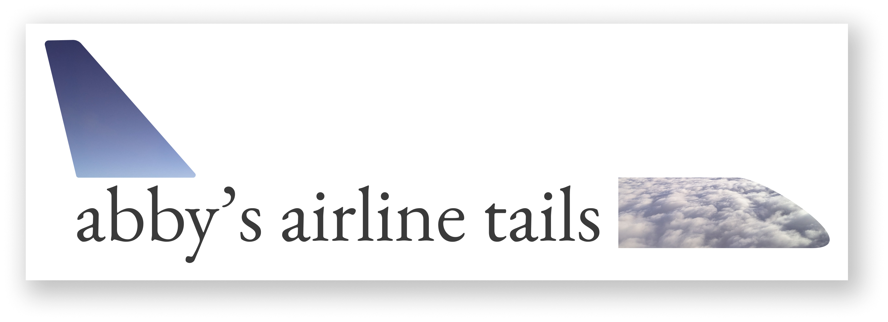
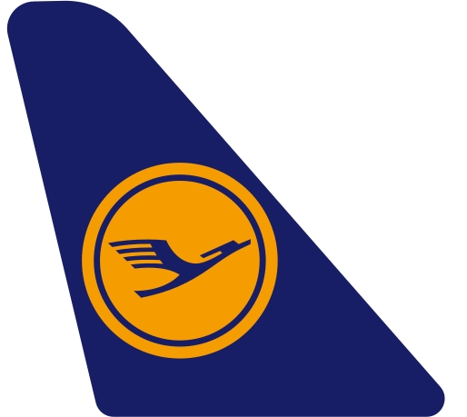
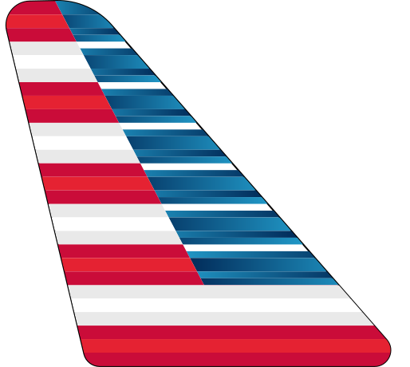

A growing collection of airline tail liveries in SVG format, because every aircraft deserves to wear its colours with infinite scalability.

## examples

You can browse the whole collection at **[tails.ab4.ca](https://tails.ab4.ca)**, but here are a few examples of the tails you can find in this collection:



> _Lufthansa has flown me across the atlantic on their mighty quad-jets a handful of times. Their modern livery is clean, but I've always preferred the cozyness and memories inspired by the retro tail._


> _I know it says "Yukon" on the tail, but Air North reminds me of my home province of BC so strongly. I have a piece of one of their 737-200s in my pocket at all times (thanks [aviationtag](https://www.aviationtag.com/)). One day I'll actually fly to the Yukon on one of their planes..._



> _I don't really have anything cute to say about American Airlines, I just like the tail._

## structure

```
airline-tails/
├── README.md
├── tails.json
└── src/
    ├── air-canada/
    │   └── modern.svg
    ├── lufthansa/
    │   ├── modern.svg
    │   └── retro.svg
    └── ...
```

Each folder under `src/` corresponds to a single airline. Inside, you'll find SVG files representing individual tail liveries. These could be retro or special liveries, or just different variants of the main one.

## tails.json

The top-level `tails.json` is the manifest for the whole collection. It lists every airline, its folder location, any alternate names it's known by (including ICAO/IATA codes), and the tails available for it.

```json
{
  "airlines": [
    {
      "name": "Air Canada",
      "folder": "air-canada",
      "alternateNames": ["AC", "ACA"],
      "tails": ["modern.svg", "retro.svg"]
    }
  ]
}
```

| field            | description                                                 |
| ---------------- | ----------------------------------------------------------- |
| `name`           | the airline's primary/canonical name                        |
| `folder`         | the corresponding subdirectory under `src/`                 |
| `alternateNames` | ICAO codes, IATA codes, former names, regional brands, etc. |
| `tails`          | list of SVG filenames available for this airline            |

The "default" normal tail for an airline will be called `modern.svg`. The first entry in the tails array will be the most up-to-date tail for an airline.

## missing an airline?

The skies are wide and this collection is still climbing to cruising altitude. If an airline is missing please [open an issue](../../issues/new) and include:

- the airline name (and any alternate names or codes)
- a **photo example** of the tail livery
- any relevant context: era, fleet type, variant liveries

Pull requests are also welcome but, I'm picky! It's gotta be good. A template can be found at [template.svg](./template.svg).

## acknowledgements

Thank you to wikimedia for hosting so many airline logo SVGs! They can be found [here](https://en.wikipedia.org/wiki/Category:SVG_logos_of_airlines).
